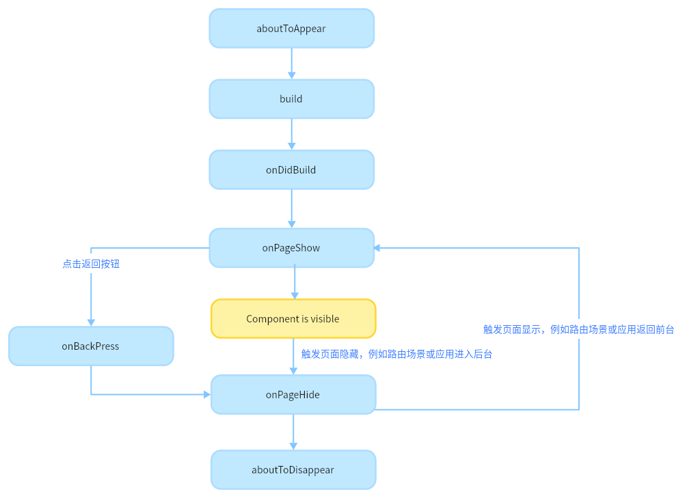
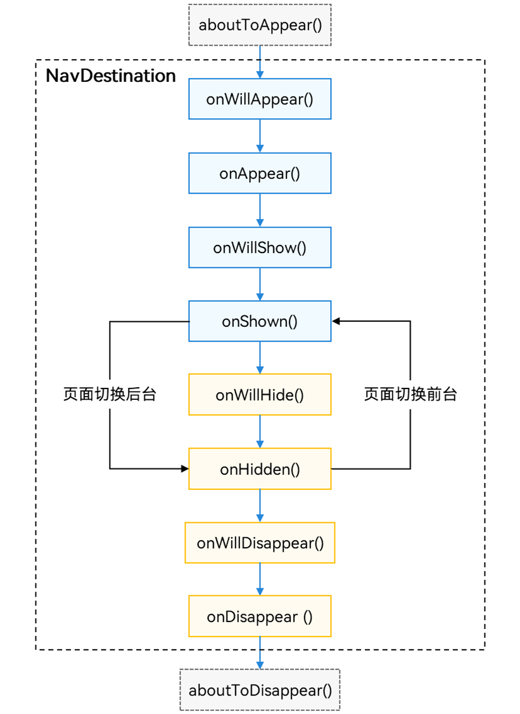
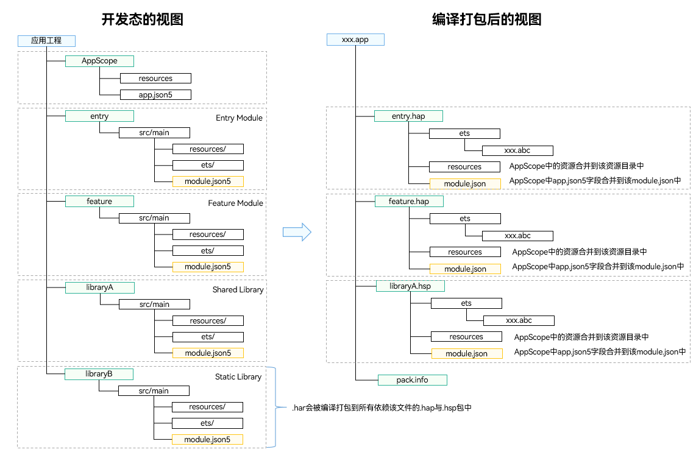
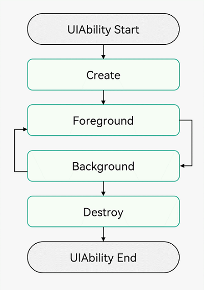
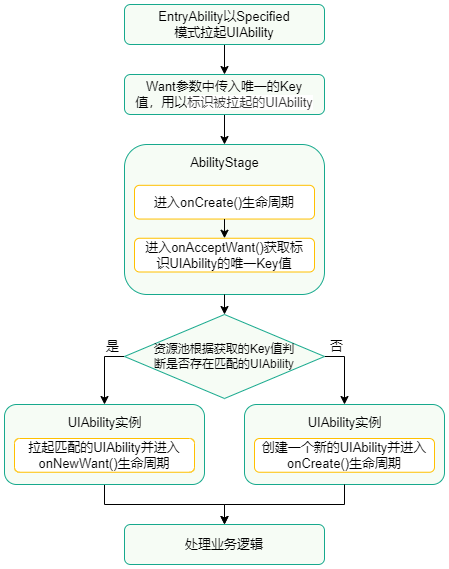

# HarmonyDemo

Harmony学习demo

### 文件类型
- 配置文件: 包括应用级配置信息、以及Module级配置信息：
  - AppScope > app.json5：app.json5配置文件，用于声明应用的全局配置信息，比如应用Bundle名称、应用名称、应用图标、应用版本号等。
  - Module_name > src > main > module.json5：module.json5配置文件，用于声明Module基本信息、支持的设备类型、所含的组件信息、运行所需申请的权限等。
- ArkTS源码文件
  - Module_name > src > main > ets：用于存放Module的ArkTS源码文件（.ets文件）。
- 资源文件：包括应用级资源文件、以及Module级资源文件，支持图形、多媒体、字符串、布局文件等
  - AppScope > resources ：用于存放应用需要用到的资源文件。
  - Module_name > src > main > resources ：用于存放该Module需要用到的资源文件。
- 其他配置文件: 用于编译构建，包括构建配置文件、编译构建任务脚本、混淆规则文件、依赖的共享包信息等
  - build-profile.json5：工程级或Module级的构建配置文件，包括应用签名、产品配置等。
  - hvigorfile.ts：应用级或Module级的编译构建任务脚本，开发者可以自定义编译构建工具版本、控制构建行为的配置参数。
  - obfuscation-rules.txt：混淆规则文件。混淆开启后，在使用Release模式进行编译时，会对代码进行编译、混淆及压缩处理，保护代码资产。
  - oh-package.json5：用于存放依赖库的信息，包括所依赖的三方库和共享包。

### 配置代码检查规则

在工程根目录下创建code-linter.json5配置文件，可对于代码检查的范围及对应生效的检查规则进行配置，其中files和ignore配置项共同确定了代码检查范围，ruleSet和rules配置项共同确定了生效的规则范围。具体配置项功能如下：

- files：配置待检查的文件名单，如未指定目录，规则适用于所有文件，例如：[“**/*.ets”,”**/*.js”,”**/*.ts”]。
- ignore：配置无需检查的文件目录，其指定的目录或文件需使用相对路径格式，相对于code-linter.json5所在工程根目录，例如：build/**/*。
- ruleSet：配置检查使用的规则集，规则集支持一次导入多条规则。规则详情请参见Code Linter代码检查规则。目前支持的规则集包括：
    - **通用规则@typescript-eslint**
    - **一次开发多端部署规则@cross-device-app-dev**
    - **ArkTS代码风格规则@hw-stylistic**
    - **安全规则@security**
    - **性能规则@performance**
    - **预览规则@previewer**
- rules：可以基于ruleSet配置的规则集，新增额外规则项，或修改ruleSet中规则默认配置，例如：将规则集中某条规则告警级别由warn改为error。

| 字段名称 | 参数说明  | 是否必选  | 类型  |  支持配置的参数 |
| ------------ | ------------ | ------------ | ------------ | ------------ |
| selector  | 配置要检查的语法  | 是  | 字符串、字符串数组  |  <ul><li>variable：变量</li><li>function：函数</li><li>parameter：参数</li><li>parameterProperty：参数属性</li><li>accessor：get/set方法</li><li>enumMember：枚举成员</li><li>classMethod：类方法</li><li>structMethod：自定义组件中的方法</li><li>objectLiteralMethod：对象方法</li><li>typeMethod：接口方法</li><li>classProperty：类属性</li><li>structProperty：自定义组件中的属性</li><li>objectLiteralProperty：对象属性</li><li>typeProperty：接口属性</li><li>class：类</li><li>struct：自定义组件</li><li>interface：接口</li><li>typeAlias：类型别名</li><li>enum：枚举</li><li>typeParameter：泛型参数</li><li>default：包含以上所有的类型</li><li>variableLike：包含variable，function，parameter</li><li>memberLike：包含classProperty，structProperty，objectLi…assMethod，objectLiteralMethod，typeMethod，accessor</li><li>typeLike：包含class，struct，interface，typeAlias，enum，typeParameter</li><li>method：包含classMethod，structMethod，objectLiteralMethod，typeMethod</li><li>property：包含classProperty，objectLiteralProperty，typeProperty</li></ul> |
| format  | 配置期望的命名风格  |  是 |  字符串数组 | <ul><li>camelCase：小驼峰命名风格，比如getName，getID（支持连续大写字母），不支持下划线</li><li>strictCamelCase：严格小驼峰命名风格，除了不支持连续大写字母（getID），其他的和camelCase相同</li><li>PascalCase：大驼峰命名风格，比如Foo，CC，除了要求第一个字母大写，其他的和camelCase相同</li><li>StrictPascalCase：大驼峰命名风格，除了不支持连续大写字母（CC），其他的和PascalCase相同</li><li>snake_case：小写字母+下划线+小写字母的命名风格，比如a_a，不支持_a，a_a_</li><li>UPPER_CASE：大写字母+下划线+大写字母的命名风格，比如A_A，不支持_A，A_A_</li></ul>  |
| custom  | 配置用户自定义的命名风格  | 否  |  对象 | <ul><li>regex：属性必选，配置具体的正则</li><li>match：属性必选，配置为true表示正则未命中时报错，配置为false表示正则命中时报错</li></ul>  |
| leadingUnderscore/trailingUnderscore  | 配置是否允许以下划线开头/以下划线结尾的命名风格  |  否 |  字符串 | <ul><li>allow：允许以一个下划线开头/结尾的命名风格，比如_name</li><li>allowDouble：允许以两个下划线开头/结尾的命名风格，比如__name</li><li>allowSingleOrDouble：允许以一个或者两个下划线开头/结尾的命名风格（allow+allowDouble）</li><li>forbid：禁止以下划线开头/结尾的命名风格，比如_name，__name</li><li>require：必须是以下划线开头/结尾的命名风格，比如_name，__name</li><li>requireDouble：必须是以两个下划线开头/结尾的命名风格，比如__name</li></ul>  |
| prefix/suffix  | 配置固定前缀/后缀的命名风格。如果前缀/后缀未匹配则报错  | 否  |  字符串数组 |  用户自定义前缀/后缀 |
| filter  |  过滤特定的命名风格，检查或者不检查正则命中的命名 | 否  | 对象  | 配置格式与custom相似match：设置为true表示只检查正则命中的名字，设置为false表示不检查正则命中的名字regex：设置过滤的正则  |
| modifiers  | 匹配修饰符，只有包含特定修饰符的命名才会检查  | 否  |  字符串数组 | <ul><li>abstract：匹配abstract关键字</li><li>override：匹配override关键字</li><li>private：匹配private关键字</li><li>protected：匹配protected关键字</li><li>static：匹配static关键字</li><li>async：匹配async关键字</li><li>const：匹配const关键字</li><li>destructured：匹配解构语法</li><li>exported：匹配export关键字</li><li>global：匹配全局声明</li><li>#private：匹配私有符号#</li><li>public：匹配public级别的访问修饰符</li><li>requiresQuotes：匹配字符串类型的命名，并且 字符串中包含特殊字符</li><li>unused：匹配未使用的声明</li></ul>  |
| types  | 匹配类型，只有特定类型的名字才会检查  | 否  | 字符串数组  | <ul><li>array：数组类型</li><li>boolean：布尔类型</li><li>function：函数类型</li><li>number：数字类型</li><li>string：字符串类型</li></ul>  |

- overrides：针对工程根目录下部分特定目录或文件，可配置定制化检查的规则。

 

> **屏蔽告警信息：**
>    -   在某些特殊场景下，若扫描结果中出现误报，点击单条告警结果后的Ignore图标，可以忽略对告警所在行的code linter检查；或勾选文件名称或多条待屏蔽的告警，点击左侧工具面板Ingore图标批量执行操作；
>    - 在文件顶部添加注释/* eslint-disable * /可以屏蔽整个文件执行code linter检查，在eslint-disable 后加入一个或多个以逗号分隔的规则Id，可以屏蔽具体检查规则；
>    - 在需要忽略检查的代码块前后分别添加/ * eslint-disable * /和/* eslint-enable * /添加注释信息，再执行Code Linter，将不再显示该代码块扫描结果；在待屏蔽的代码行前一行添加/* eslint-disable-next-line */，也可屏蔽对该代码行的codelinter检查。

## 切换工程视图
DevEco Studio工程目录结构提供工程视图和Ohos视图。工程视图（Project）展示工程中实际的文件结构，Ohos视图会隐藏一些编码中不常用到的文件，并将常用到的文件进行重组展示，方便开发者查询或定位所需编辑的模块或文件。

### 页面生命周期，即被@Entry装饰的组件生命周期，提供以下生命周期接口：

* onPageShow：页面每次显示时触发一次，包括路由过程、应用进入前台等场景。

* onPageHide：页面每次隐藏时触发一次，包括路由过程、应用进入后台等场景。

* onBackPress：当用户点击返回按钮时触发。
### 组件生命周期，即一般用@Component装饰的自定义组件的生命周期，提供以下生命周期接口：

* aboutToAppear：组件即将出现时回调该接口，具体时机为在创建自定义组件的新实例后，在执行其build()函数之前执行。

* onDidBuild：组件build()函数执行完成之后回调该接口，开发者可以在这个阶段进行埋点数据上报等不影响实际UI的功能。不建议在onDidBuild函数中更改状态变量、使用animateTo等功能，这可能会导致不稳定的UI表现。

* aboutToDisappear：aboutToDisappear函数在自定义组件析构销毁之前执行。不允许在aboutToDisappear函数中改变状态变量，特别是@Link变量的修改可能会导致应用程序行为不稳定。

### Navigation页面生命周期：Navigation作为路由容器，其生命周期承载在NavDestination组件上，以组件事件的形式开放

其生命周期大致可分为三类，自定义组件生命周期、通用组件生命周期和自有生命周期。其中，aboutToAppear和aboutToDisappear是自定义组件的生命周期(NavDestination外层包含的自定义组件)，OnAppear和OnDisappear是组件的通用生命周期。剩下的六个生命周期为NavDestination独有。

* aboutToAppear：在创建自定义组件后，执行其build()函数之前执行（NavDestination创建之前），允许在该方法中改变状态变量，更改将在后续执行build()函数中生效。
* onWillAppear：NavDestination创建后，挂载到组件树之前执行，在该方法中更改状态变量会在当前帧显示生效。
* onAppear：通用生命周期事件，NavDestination组件挂载到组件树时执行。
* onWillShow：NavDestination组件布局显示之前执行，此时页面不可见（应用切换到前台不会触发）。
* onShown：NavDestination组件布局显示之后执行，此时页面已完成布局。
* onWillHide：NavDestination组件触发隐藏之前执行（应用切换到后台不会触发）。
* onHidden：NavDestination组件触发隐藏后执行（非栈顶页面push进栈，栈顶页面pop出栈或应用切换到后台）。
* onWillDisappear：NavDestination组件即将销毁之前执行，如果有转场动画，会在动画前触发（栈顶页面pop出栈）。
* onDisappear：通用生命周期事件，NavDestination组件从组件树上卸载销毁时执行。
* aboutToDisappear：自定义组件析构销毁之前执行，不允许在该方法中改变状态变量。

## 自定义组件的基本结构
* struct：自定义组件基于struct实现，struct + 自定义组件名 + {...}的组合构成自定义组件，不能有继承关系。对于struct的实例化，可以省略new。
* @Component：@Component装饰器仅能装饰struct关键字声明的数据结构。struct被@Component装饰后具备组件化的能力，需要实现build方法描述UI，一个struct只能被一个@Component装饰。@Component可以接受一个可选的bool类型参数。
* build()：build()函数用于定义自定义组件的声明式UI描述，自定义组件必须定义build()函数。
* @Entry：@Entry装饰的自定义组件将作为UI页面的入口。在单个UI页面中，最多可以使用@Entry装饰一个自定义组件。@Entry可以接受一个可选的LocalStorage的参数。
* @Reusable：@Reusable装饰的自定义组件具备可复用能力。

### 开发态与编译态的工程结构视图

从开发态到编译态，Module中的文件会发生如下变更：

* ets目录：ArkTS源码编译生成.abc文件。
* resources目录：AppScope目录下的资源文件会合入到Module下面资源目录中，如果两个目录下存在重名文件，编译打包后只会保留AppScope目录下的资源文件。
* module配置文件：AppScope目录下的app.json5文件字段会合入到Module下面的module.json5文件之中，编译后生成HAP或HSP最终的module.json文件。

### UIAbility组件生命周期
UIAbility的生命周期包括Create、Foreground、Background、Destroy四个状态，如下图所示。

#### Create状态    
Create状态为在应用加载过程中，UIAbility实例创建完成时触发，系统会调用onCreate()回调。可以在该回调中进行页面初始化操作，例如变量定义资源加载等，用于后续的UI展示。

#### WindowStageCreate和WindowStageDestroy状态    
UIAbility实例创建完成之后，在进入Foreground之前，系统会创建一个WindowStage。WindowStage创建完成后会进入onWindowStageCreate()回调，可以在该回调中设置UI加载、设置WindowStage的事件订阅。 
在onWindowStageCreate()回调中通过loadContent()方法设置应用要加载的页面，并根据需要调用on('windowStageEvent')方法订阅WindowStage的事件（获焦/失焦、切到前台/切到后台、前台可交互/前台不可交互）。 
对应于onWindowStageCreate()回调。在UIAbility实例销毁之前，则会先进入onWindowStageDestroy()回调，可以在该回调中释放UI资源。 
#### WindowStageWillDestroy状态 
对应onWindowStageWillDestroy()回调，在WindowStage销毁前执行，此时WindowStage可以使用。 
#### Foreground和Background状态 
Foreground和Background状态分别在UIAbility实例切换至前台和切换至后台时触发，对应于onForeground()回调和onBackground()回调。 
onForeground()回调，在UIAbility的UI可见之前，如UIAbility切换至前台时触发。可以在onForeground()回调中申请系统需要的资源，或者重新申请在onBackground()中释放的资源。 
onBackground()回调，在UIAbility的UI完全不可见之后，如UIAbility切换至后台时候触发。可以在onBackground()回调中释放UI不可见时无用的资源，或者在此回调中执行较为耗时的操作，例如状态保存等。 
#### Destroy状态 
Destroy状态在UIAbility实例销毁时触发。可以在onDestroy()回调中进行系统资源的释放、数据的保存等操作。 

### UIAbility组件启动模式
#### singleton启动模式
singleton启动模式为单实例模式，也是默认情况下的启动模式。

每次调用startAbility()方法时，如果应用进程中该类型的UIAbility实例已经存在，则复用系统中的UIAbility实例。系统中只存在唯一一个该UIAbility实例，即在最近任务列表中只存在一个该类型的UIAbility实例。
#### multiton启动模式
multiton启动模式为多实例模式，每次调用startAbility()方法时，都会在应用进程中创建一个新的该类型UIAbility实例。即在最近任务列表中可以看到有多个该类型的UIAbility实例。这种情况下可以将UIAbility配置为multiton（多实例模式）。
#### specified启动模式
specified启动模式为指定实例模式，针对一些特殊场景使用（例如文档应用中每次新建文档希望都能新建一个文档实例，重复打开一个已保存的文档希望打开的都是同一个文档实例）。

### RCP与HTTP的区别

| 功能名称 | 功能描述 | HTTP | RCP |
| ------- | ------- | ------- | ------- |
| 发送PATCH类型请求 | 以PATCH的方式请求 | 不支持 | 支持 |
| 设置会话中URL的基地址 | 会话中URL的基地址将自动加在URL前面，除非URL是一个绝对的URL | 不支持 | 支持 |
| 取消自动重定向 | HTTP请求不会自动重定向 | 不支持 | 支持 |
| 拦截请求和响应 | 在请求后或响应前进行拦截 | 不支持 | 支持 |
| 取消请求 | 发送请求前取消、发送请求过程中取消、请求接收后取消 | 不支持 | 支持 |
| 响应缓存 | 是否使用缓存，请求时优先读取缓存。缓存跟随当前进程生效，新缓存会替换旧缓存 | 不支持 | 支持 |
| 设置响应数据的类型 | 设置数据以何种方式返回，将要响应的数据类型可设置为string、object、arraybuffer等类型 | 支持 | 不支持 |
| 定义允许的HTTP响应内容的最大字节数 | 服务器成功响应时，在获取数据前校验响应内容的最大字节数 | 支持 | 不支持 |
| 自定义证书校验 | 自定义逻辑校验客户端和服务端的证书，判断是否可以连接 | 不支持 | 支持 |
| 忽略SSL校验 | 在建立SSL连接时不验证服务器端的SSL证书 | 不支持 | 支持 |
| 自定义DNS解析 | 包括自定义DNS服务器或静态DNS规则 | 不支持 | 支持 |
| 捕获详细的跟踪信息 | 在会话中的HTTP请求期间捕获详细的跟踪信息。跟踪有助于调试、性能分析和深入了解通信过程中的数据流 | 不支持 | 支持 |
| 数据打点，获取HTTP请求的具体数据 | HTTP请求各阶段的定时信息 | 不支持 | 支持 |

